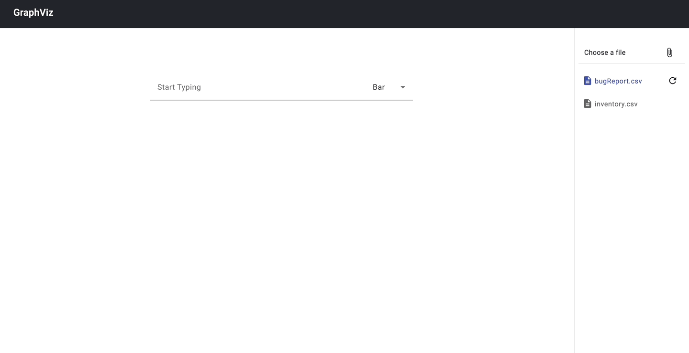
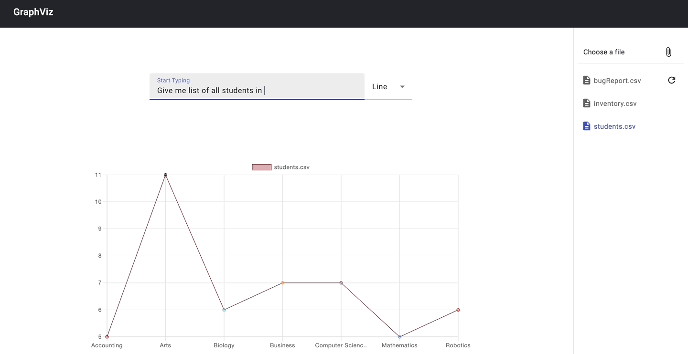

# Graphviz: SQL Database Visualization Tool
Graphviz is an innovative project that empowers users to seamlessly upload SQL database files in CSV format through its intuitive frontend functionality. Once uploaded, users can effortlessly query the database using natural language. The results of these queries are then dynamically displayed in various graphical formats, including bar graphs, line graphs, or tables, providing users with clear and insightful visual representations of their data.

### Features
-   
    **Easy Database Upload**: Upload SQL database files in CSV format with a simple frontend interface.
-   **Natural Language Queries**: Query your database using natural language for a user-friendly experience.
-   **Dynamic Visualization**: Visualize query results dynamically with options for bar graphs, line graphs, or tables.
-   **Powered by OpenAI API**: Utilizes the robust capabilities of OpenAI API in the backend for efficient processing and natural language understanding.
 
# Getting Started

To get started with Next Word Prediction, follow these steps:

### API Setup

1. Make sure you have Python installed on your system.
2. Create a new conda environment. Install the required dependencies by running the following commands:

```bash
$ conda create -n env <env_name>
$ conda activate <env_name>
$ pip install -r requirements.txt
```
3. Start the API service by running the `app.py` file:
```bash
$ python app.py
```

To enable frontend functionality, a separate service needs to be initiated.GitHub repository for the frontend - [graphviz-frontend](https://github.com/Sheel-ui/graphviz-frontend)

# Changing env variables and Models

### API

1. You can find a `.env` file in the api directory. Open the file using the following command
```bash
$ vi api/.env
```
2. You can change `HOST`, `PORT` or the `ENDPOINT` of the flask service here.
3. Update your OpenAI API key in the `.env` file.


# Demo




